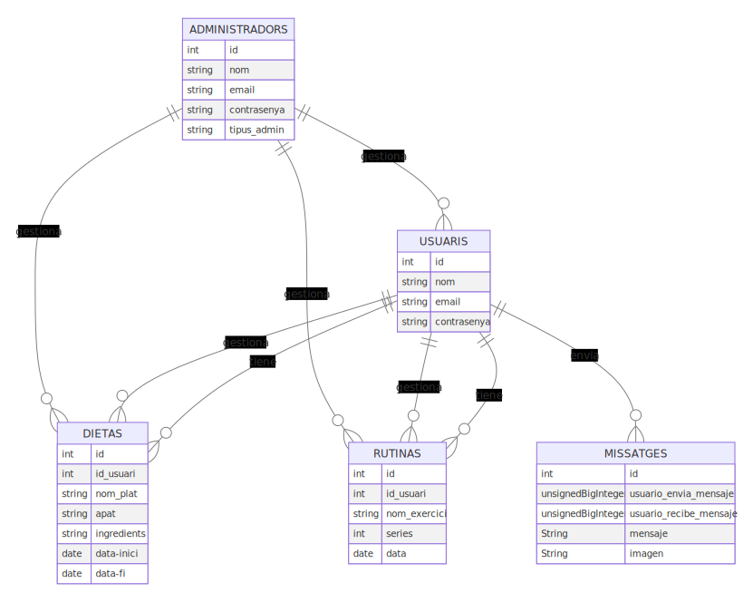

# Disseny i Diagrames

## Dissenys:
El nostre projecte va constar de dos dissenys 
- [Un Penpot](https://design.penpot.app/#/view/93d0ad32-dfe5-8194-8003-d196a1776455?page-id=93d0ad32-dfe5-8194-8003-d196a1776456&section=interactions&frame-id=c57b177c-d2d1-8023-8003-d1c548b8c65b&index=0&share-id=93d0ad32-dfe5-8194-8003-d1ca957c9e03) 
- [Un WireFrame](https://miro.com/app/board/uXjVKEQFCMQ=/?moveToWidget=3458764590116313979&cot=14)

El Wireframe es pot veure també al pdf adjunt dins la carpeta.

## Diagrames:
### Diagrama de Classes:

### Diagrama d'Activitats:

### Diagrama  de base de dades:

